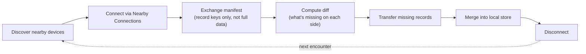
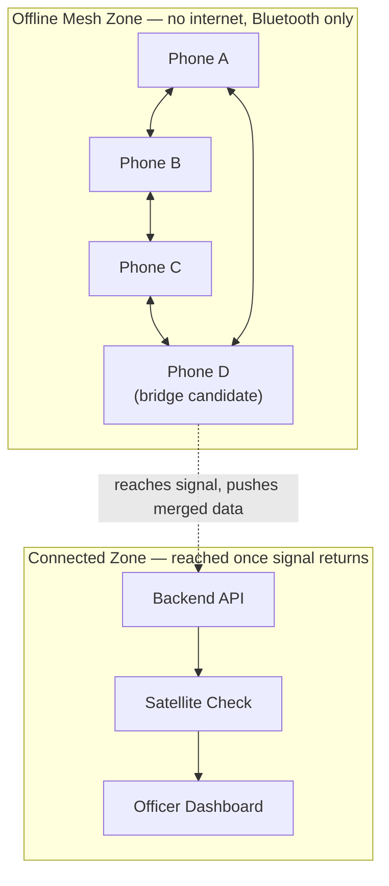
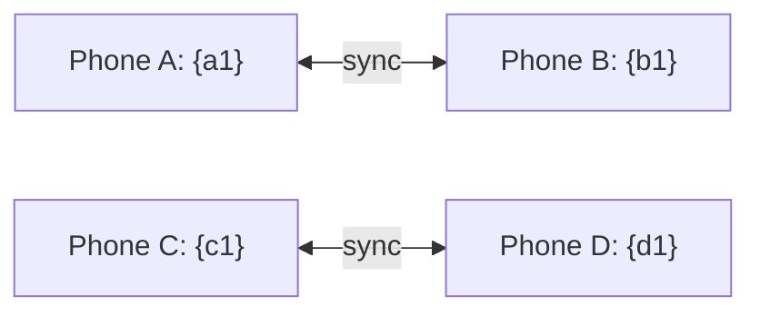
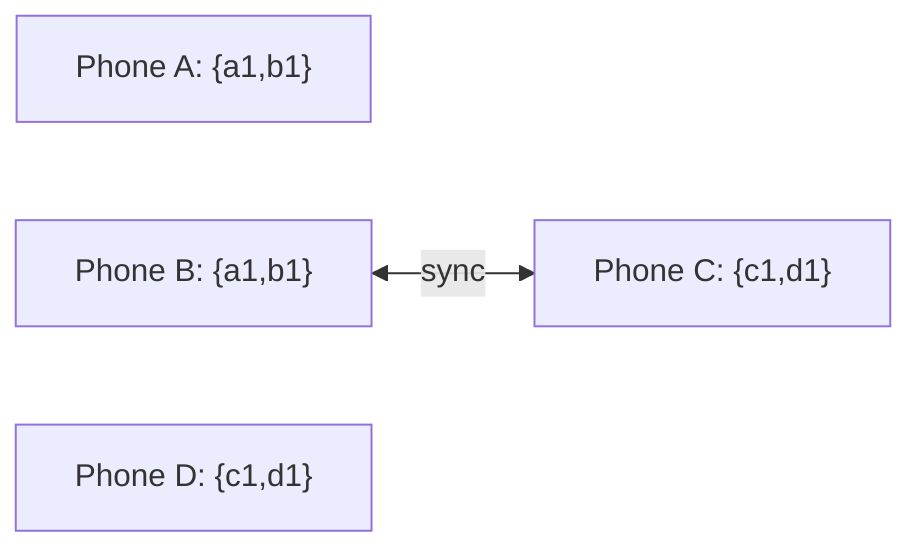
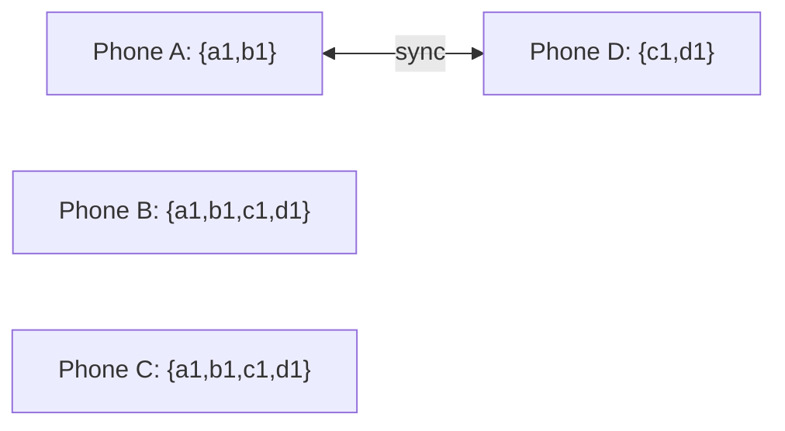
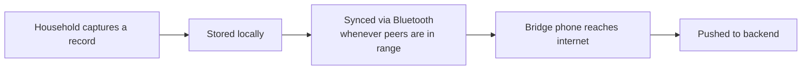
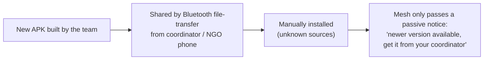

# Bluetooth Mesh — Protocol, Design & Workflows

**Scope note:** Android-only for this build (Nearby Connections API), but the transport is wrapped behind our own interface — so a custom cross-platform BLE protocol can replace it later without touching the sync/merge logic underneath.

---

## 1. Protocol Workflow — the sync handshake between two phones

Every record is uniquely keyed (device ID + local counter) and append-only, so step F is always a simple set union — never a conflict to resolve.

---

## 2. Mesh Design — offline zone bridging to the connected zone

Any phone in the mesh can become the bridge — there's no fixed "coordinator device." Whichever phone happens to reach signal first is the one that syncs the group's accumulated data to the backend.

---

## 3. Data travel between a room of people — propagation without full connectivity

The point: nobody has to meet everybody directly. Three rounds of pairwise syncs are enough for four people to fully converge.

**Round 1** — A syncs with B, C syncs with D:

*Result: A and B both hold {a1,b1}. C and D both hold {c1,d1}.*

**Round 2** — B syncs with C (A and D happen to be out of range this round):

*Result: B and C now hold the full set {a1,b1,c1,d1}. A and D are still partial.*

**Round 3** — A syncs with D:

*Result: A and D now also hold {a1,b1,c1,d1}. All four phones converged — even though A and C never met directly, and B and D never met directly.*

---

## 4. Data updates vs. app version updates — two separate flows, deliberately

**Data updates — automatic, part of normal operation:**

**App version updates — manual and controlled, never automatic:**

**Why these are separate:** letting phones silently push app *code* to each other over the mesh would let a single compromised device spread malware exactly like it spreads legitimate data. Data sync stays automatic because merging structured records is safe. Code distribution stays manual and controlled because installing software isn't.
